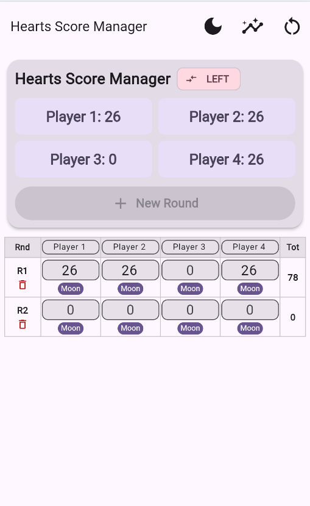
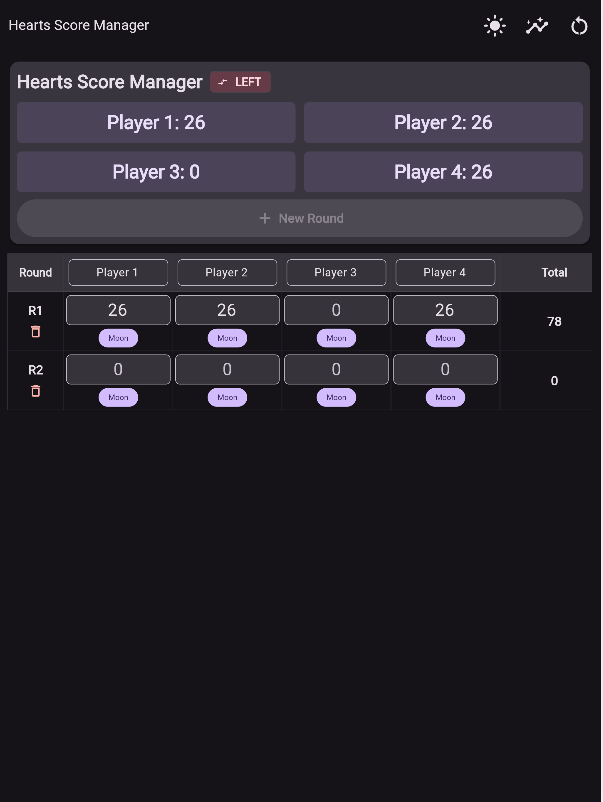
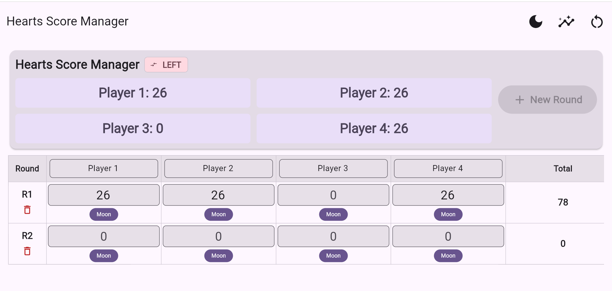

# Hearts Flutter

Hearts game point management system in flutter and sqlite database.

## Built Windows And Android App

Inside "App-Releases" folder:
1. app-release.apk file for android app
2. "Release" folder for windows app
Download and run in your device to check.

## Start Development

1. download this repository in your machine.
2. run "flutter pub get" to resolve packages.
3. run "flutter run" to run this project.

## Phone Screen

## Tab Screen In Dark Mode

## Desktop Screen

## Contact
For any inquiries, reach out to me at [rajon.kobir@gmail.com](mailto:rajon.kobir@gmail.com).